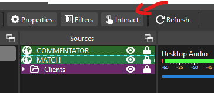
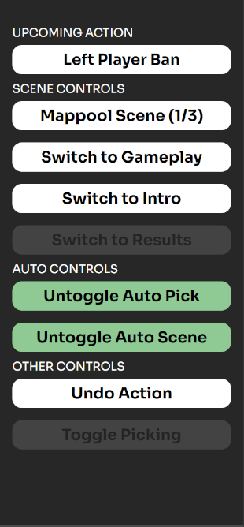
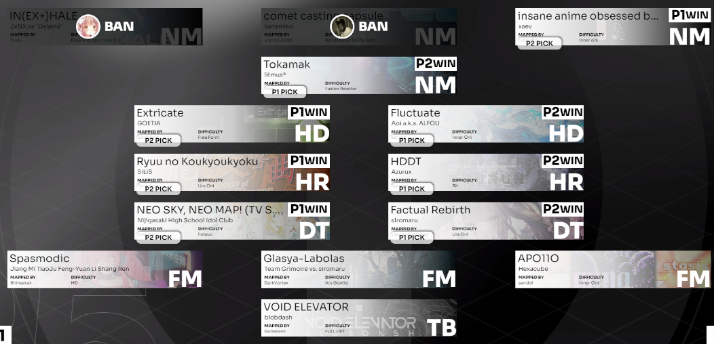
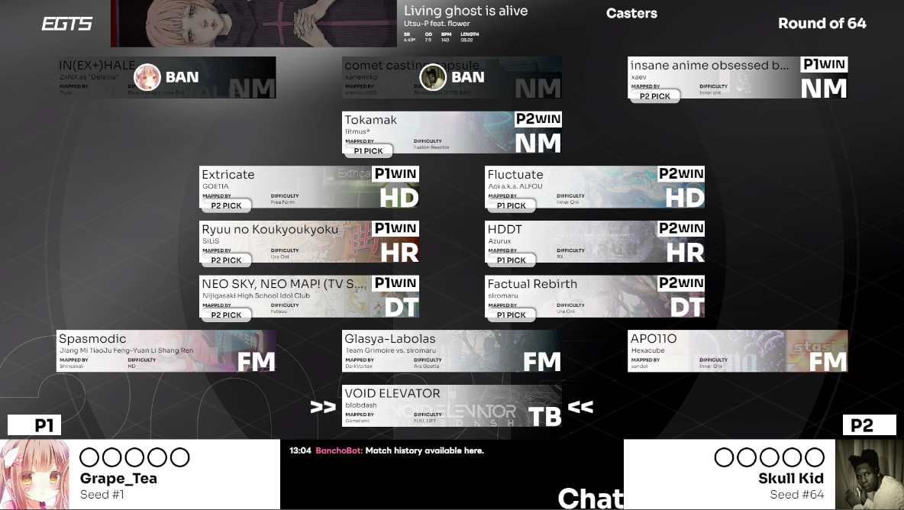
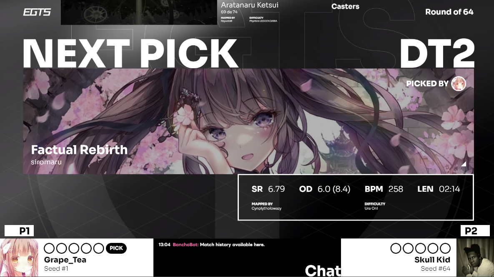
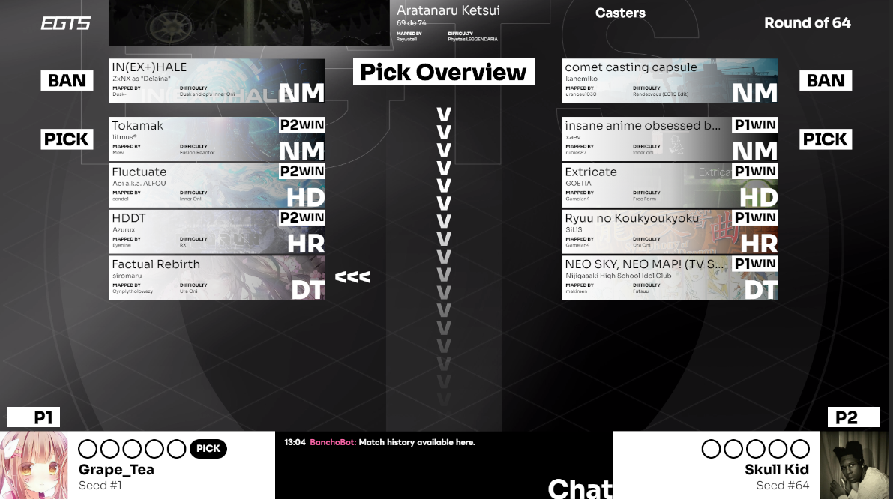
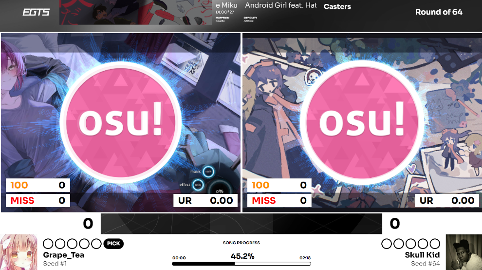
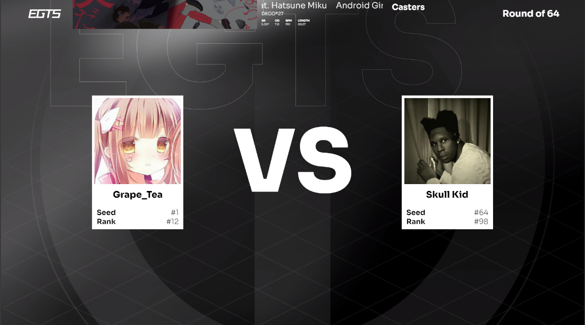
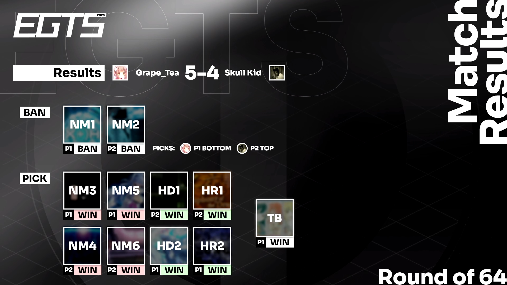

# gts-stream
The main repository for the overlay of Expert Global Taiko Showdown 2025, meant to run on tosu

___
## INSTALLATION PROCESS
### OBS Scene
The scene file is located as `./_data/obs_scenes/EGTS_SHOWCASE_day_month_index.json`. Just pick the one with the latest version when importing into OBS. If prompted with missing files, select the `./_shared_assets/` folder (select the child folders if there's assets still missing).

### Tosu & Stream Directory
**[Project link for tosu](https://github.com/KotRikD/tosu#readme)**

Download the latest release and export `tosu.exe` in any directory you want. Then create a folder named `static` in that directory and run `tosu.exe`.

To properly import all overlays, download the latest release of this project and import it into the static folder. If you have an osu! client open, the OBS scenes should properly reflect the scenes. If it doesn't project anything, contact `louscmh` immediately.

### API Setup
For the overlay to properly function, it will require you to insert an API key into `./_data/api.json`.

You can find your own osu! API at https://osu.ppy.sh/home/account/edit#legacy-api, make sure to not reveal this api key to anyone else (otherwise they will have the potential to steal your credentials)

___
## INTERACTING WITH THE OVERLAY
Within the Match Overlay there are a few elements that requires the streamer to manually click on them to properly display relevant details. To interact with the Overlay, click on the `Interact` Button when selecting the Match Overlay in OBS.

### Interacting with the Control Panel

This is the main interactable panel that contains all the buttons to manage the overlay. In order from top to bottom:
___
- **UPCOMING ACTION:** Will display one of the following actions: `Left/Right Player Ban/Pick`. This denotes what action will be performed upon clicking on the maps in the pool overview, and will automatically switch players whenever a map is clicked (Except on the 2nd ban, then the next action will retain the same player, attaining the 2nd ban 1st pick rule). Click on the button to manually switch players (Left -> Right, Right -> Left). `Ban` will change to `Pick` after banning 2 maps.
___
**SCENE CONTROLS**
- **MAPPOOL SCENE:** Button to switch scenes regarding the mappool. Will cycle through the following scenes in a loop: Mappool Overview (default) -> Upcoming Map -> Mappool Queue

- **SWITCH TO GAMEPLAY:** Button to switch scenes from mappool to gameplay. Upon pressing again will return you to the mappool scene.

- **SWITCH TO INTRO:** Button to switch scenes from main match scene to intro. Upon pressing again will return you to the mappool scene.

- **SWITCH TO RESULTS:** Button to switch scenes from main match scene to results. Upon pressing again will return you to the main match scene scene. Disabled by default, and will only be enabled when the following two things happen:
    - One of the players have reached the maximum amount of points in the tournament client. 
    - The exact amount of picks marked as a win neccessary to win by a player has been reached.
___
**AUTO CONTROLS**
Both buttons are toggled on by default and should only be turned off if fixing an error/debugging.
- **AUTO PICK:** Button to toggle/untoggle Auto Pick. When turned on, the following happens:
    - **When the client detects a new beatmap that is part of the pool, it will automatically pick it in the pool.** This will only happen after the ban phase
    - After both players finish playing a map that is part of the pool, the scores will be tallied, and the pick will be marked as a win by the player that won in the overlay. (To debug this, Alt + Left Click to mark as P1 Win, Alt + Right Click to mark as P2 Win)

- **AUTO SCENE:** Button to toggle/untoggle Auto Scene. When turned on, the following happens:
    - After ban phase is completed, when a map is picked in the **Mappool Overview Scene**, the overlay will switch to the **Upcoming Map Scene** in **15 seconds**.
    - When the client enters into a map (denoting he start of a map), the overlay will switch from the **Mappool Scene** to the **Match Scene**.
    - Once a map is finished, the client will switch from the **Upcoming Map Scene** to the **Mappool Queue Scene** in the background. After **30 seconds**, it will switch from the **Match Scene** to the **Mappool Scene** (this will happen automatically if the client enters idle state first).
    - When switching from the **Match Scene** to the **Mappool Queue Scene**, the overlay will continue switching to the **Mappool Overview Scene** in **25 seconds**.
    - This process is repeated for every map in the pool, denoting the expected flow of the matches.
___
**OTHER CONTROLS**
- **UNDO ACTION:** Button to retract the latest action performed by the **UPCOMING ACTION** button, which includes reversing the player order.
- **TOGGLE PICKING:** Button to unhide all picking assets, indicating the start of the next pick. This will be toggled automatically when a win on a pick is marked.
___
### Banning/Picking Maps

While hovering over any of the beatmaps, upon Left Clicking the action denoted by the UPCOMING ACTION button will be applied. This concerns the banning & picking of all maps in the pool.

___
## Scene Index

### Mappool Overview - Mappool Scene (1/3)

### Upcoming Map - Mappool Scene (2/3)

### Mappool Queue - Mappool Scene (3/3)

### Match Scene

### Intro Scene

### Winner Scene

