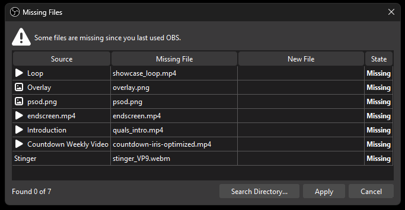

# gts-stream
The main repository for the overlay of Expert Global Taiko Showdown 2025, meant to run on tosu

___
## INSTALLATION PROCESS
### OBS Scene
The scene file is located in `./_data/obs_scenes/`. The JSON file will be named **EGTS_day_month_index** in the directory. Just pick the one with the latest version when importing into OBS

After importing the scene file, you should be prompted with a Missing Files tab.

Click on "Search Directory..." and select the `_shared_assets` folder in the project files. If it doesn't fully link all the missing files, try selecting the subfolders in the `_shared_assets` folder. After that, just click on Apply and the assets should be displayed.

### Tosu & Stream Directory
**[Project link for tosu](https://github.com/KotRikD/tosu#readme)**

To install the application, just download the latest release and export `tosu.exe` in whatever directory you want. Then in that same directory, create a static folder and run `tosu.exe`.

To properly import all overlays, download the latest release of this project and import it into the static folder. If you have an osu! client open, the OBS scenes should properly reflect the scenes. If there's any issue projecting the overlay on OBS, you can try finding the URL link of the individual overlays by scrolling down to the target overlay and clicking on the URL parameter.

If you open the link in the browser and it doesn't project anything, contact `louscmh` immediately. If not, then OBS should be able to project the browser source.

### API Setup
The match overlays uses the following JSON to function:
- `api.json`
- `beatmaps.json`
- `seeding.json`
- `stage.json`

For the match overlay to properly function & display both player & beatmap details, it will require you to insert an API key into `./_data/api.json`.

You can find your own osu! API at https://osu.ppy.sh/home/account/edit#legacy-api, make sure to not reveal this api key to anyone else (otherwise they will have the potential to steal your credentials)

Within the Match Overlay there are a few interactable elemenets that requires the streamer to manually click on them to properly display what is being picked, who is it being picked by, moving on to the next map etc. To interact with the Overlay, click on the `Interact` Button when selecting the Match Overlay in OBS.

___
## INTERACTING WITH THE OVERLAY

